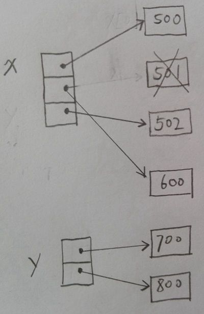

# 第八章 Python赋值机制

# 8.1 基本数据类型
## 8.1.1 赋值时内存分配
两个变量指向同一个内存的其中一个目的是**节省内存**
```
# 分配一个内存
x = 500
id(x) # 1984401046384
# 指向同一个内存
y = x
id(y) # 1984401046384
# 为y分配新的内存
y = 4
id(y) # 1441923664
x # 500
```
## 8.1.2 为每一个变量单独赋值
```
x = 500
id(x) # 1984401046384
y = 500
id(y) # 1984401046192
```
## 8.1.3 为每一个变量单独赋小的int值
如果单独赋较小的int类型的值，内存会是一个可以提高内存利用率。
```
x = 2
id(x) # 1441923600
t = 2
id(y) # 1441923600
```
# 8.2 容器类型
```
x = [500, 501, 502]
y = x
y[1] = 600
y = [700, 800]
```
解析：
```
x = [500, 501, 502]
```

```
y = x
```

```
y[1] = 600
```

```
y = [700, 800]
```



